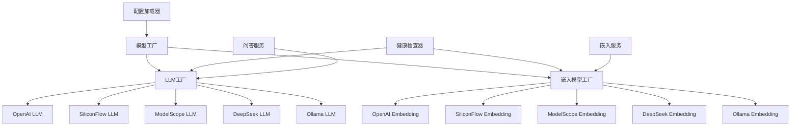

# 多平台模型支持设计文档

## 概述

本文档描述了为RAG知识问答系统添加多平台模型支持的技术设计。系统将扩展现有的LLM和嵌入模型架构，支持硅基流动(SiliconFlow)、魔塔(ModelScope)、DeepSeek、本地Ollama等多个平台。设计采用工厂模式和插件化架构，确保良好的扩展性和兼容性。

## 架构

### 扩展架构图



### 技术栈扩展

- **新增依赖**: requests (HTTP客户端)
- **配置管理**: YAML配置文件
- **错误处理**: 统一异常处理机制
- **日志记录**: 结构化日志记录
- **健康检查**: 启动时连接测试

## 组件和接口

### 1. 基础抽象类

#### BaseLLM (基础LLM类)
```python
from abc import ABC, abstractmethod
from typing import Dict, Any, Optional
import logging

class BaseLLM(ABC):
    """LLM基础抽象类"""
    
    def __init__(self, config: Dict[str, Any]):
        self.config = config
        self.logger = logging.getLogger(self.__class__.__name__)
    
    @abstractmethod
    def generate(self, prompt: str, **kwargs) -> str:
        """生成文本回复"""
        pass
    
    @abstractmethod
    def generate_with_context(self, question: str, context: str, **kwargs) -> Dict[str, Any]:
        """基于上下文生成回答"""
        pass
    
    @abstractmethod
    def get_model_info(self) -> Dict[str, Any]:
        """获取模型信息"""
        pass
    
    @abstractmethod
    def health_check(self) -> bool:
        """健康检查"""
        pass
```

#### BaseEmbedding (基础嵌入类)
```python
from abc import ABC, abstractmethod
from typing import List, Dict, Any
import logging

class BaseEmbedding(ABC):
    """嵌入模型基础抽象类"""
    
    def __init__(self, config: Dict[str, Any]):
        self.config = config
        self.logger = logging.getLogger(self.__class__.__name__)
    
    @abstractmethod
    def embed(self, text: str) -> List[float]:
        """生成单个文本的嵌入向量"""
        pass
    
    @abstractmethod
    def embed_batch(self, texts: List[str]) -> List[List[float]]:
        """批量生成嵌入向量"""
        pass
    
    @abstractmethod
    def get_dimension(self) -> int:
        """获取嵌入向量维度"""
        pass
    
    @abstractmethod
    def get_model_info(self) -> Dict[str, Any]:
        """获取模型信息"""
        pass
    
    @abstractmethod
    def health_check(self) -> bool:
        """健康检查"""
        pass
```

### 2. 平台实现类

#### SiliconFlow实现
```python
class SiliconFlowLLM(BaseLLM):
    """硅基流动LLM实现"""
    
    def __init__(self, config: Dict[str, Any]):
        super().__init__(config)
        self.api_key = config.get('api_key', '')
        self.base_url = config.get('base_url', 'https://api.siliconflow.cn/v1')
        self.model = config.get('model', 'Qwen/Qwen2-7B-Instruct')
        self.max_tokens = config.get('max_tokens', 1000)
        self.temperature = config.get('temperature', 0.7)
        
    def generate(self, prompt: str, **kwargs) -> str:
        # 实现API调用逻辑
        pass

class SiliconFlowEmbedding(BaseEmbedding):
    """硅基流动嵌入模型实现"""
    
    def __init__(self, config: Dict[str, Any]):
        super().__init__(config)
        self.api_key = config.get('api_key', '')
        self.base_url = config.get('base_url', 'https://api.siliconflow.cn/v1')
        self.model = config.get('model', 'BAAI/bge-large-zh-v1.5')
        self.dimension = config.get('dimension', 1024)
        
    def embed(self, text: str) -> List[float]:
        # 实现嵌入向量生成逻辑
        pass
```

### 3. 工厂类

#### LLM工厂
```python
class LLMFactory:
    """LLM工厂类"""
    
    _providers = {
        'openai': OpenAILLM,
        'siliconflow': SiliconFlowLLM,
        'modelscope': ModelScopeLLM,
        'deepseek': DeepSeekLLM,
        'ollama': OllamaLLM,
        'mock': MockLLM
    }
    
    @classmethod
    def create_llm(cls, provider: str, config: Dict[str, Any]) -> BaseLLM:
        """创建LLM实例"""
        if provider not in cls._providers:
            raise ValueError(f"Unsupported LLM provider: {provider}")
        
        llm_class = cls._providers[provider]
        return llm_class(config)
    
    @classmethod
    def get_available_providers(cls) -> List[str]:
        """获取可用的提供商列表"""
        return list(cls._providers.keys())
```

#### 嵌入模型工厂
```python
class EmbeddingFactory:
    """嵌入模型工厂类"""
    
    _providers = {
        'openai': OpenAIEmbedding,
        'siliconflow': SiliconFlowEmbedding,
        'modelscope': ModelScopeEmbedding,
        'deepseek': DeepSeekEmbedding,
        'ollama': OllamaEmbedding,
        'mock': MockEmbedding
    }
    
    @classmethod
    def create_embedding(cls, provider: str, config: Dict[str, Any]) -> BaseEmbedding:
        """创建嵌入模型实例"""
        if provider not in cls._providers:
            raise ValueError(f"Unsupported embedding provider: {provider}")
        
        embedding_class = cls._providers[provider]
        return embedding_class(config)
```

## 数据模型

### 配置模型
```python
@dataclass
class LLMConfig:
    provider: str
    model: str
    api_key: Optional[str] = None
    base_url: Optional[str] = None
    max_tokens: int = 1000
    temperature: float = 0.7
    timeout: int = 60
    
@dataclass
class EmbeddingConfig:
    provider: str
    model: str
    api_key: Optional[str] = None
    base_url: Optional[str] = None
    dimension: int = 1536
    batch_size: int = 100
    timeout: int = 60

@dataclass
class ModelHealth:
    provider: str
    model: str
    is_healthy: bool
    last_check: datetime
    error_message: Optional[str] = None
```

## 配置管理

### 配置文件结构
```yaml
# config.yaml
llm:
  provider: "siliconflow"  # openai, siliconflow, modelscope, deepseek, ollama
  model: "Qwen/Qwen2-7B-Instruct"
  api_key: "${SILICONFLOW_API_KEY}"
  base_url: "https://api.siliconflow.cn/v1"
  max_tokens: 1000
  temperature: 0.7
  timeout: 60

embeddings:
  provider: "siliconflow"  # openai, siliconflow, modelscope, deepseek, ollama
  model: "BAAI/bge-large-zh-v1.5"
  api_key: "${SILICONFLOW_API_KEY}"
  base_url: "https://api.siliconflow.cn/v1"
  dimension: 1024
  batch_size: 100
  timeout: 60

# 平台特定配置
platforms:
  siliconflow:
    api_key: "${SILICONFLOW_API_KEY}"
    base_url: "https://api.siliconflow.cn/v1"
    available_llm_models:
      - "Qwen/Qwen2-7B-Instruct"
      - "Qwen/Qwen2-72B-Instruct"
      - "deepseek-ai/DeepSeek-V3"
    available_embedding_models:
      - "BAAI/bge-large-zh-v1.5"
      - "BAAI/bge-base-zh-v1.5"
  
  modelscope:
    api_key: "${MODELSCOPE_API_KEY}"
    base_url: "https://dashscope.aliyuncs.com/api/v1"
    available_llm_models:
      - "qwen-turbo"
      - "qwen-plus"
      - "qwen-max"
    available_embedding_models:
      - "text-embedding-v1"
      - "text-embedding-v2"
  
  deepseek:
    api_key: "${DEEPSEEK_API_KEY}"
    base_url: "https://api.deepseek.com/v1"
    available_llm_models:
      - "deepseek-chat"
      - "deepseek-coder"
    available_embedding_models:
      - "deepseek-embedding"
  
  ollama:
    base_url: "http://localhost:11434"
    available_llm_models:
      - "llama2"
      - "qwen2"
      - "deepseek-coder"
    available_embedding_models:
      - "nomic-embed-text"
      - "mxbai-embed-large"
```

### 环境变量
```bash
# .env
SILICONFLOW_API_KEY=your_siliconflow_api_key
MODELSCOPE_API_KEY=your_modelscope_api_key
DEEPSEEK_API_KEY=your_deepseek_api_key
```

## 错误处理

### 异常类定义
```python
class ModelError(Exception):
    """模型相关错误基类"""
    pass

class ModelConfigError(ModelError):
    """模型配置错误"""
    pass

class ModelConnectionError(ModelError):
    """模型连接错误"""
    pass

class ModelResponseError(ModelError):
    """模型响应错误"""
    pass

class UnsupportedProviderError(ModelError):
    """不支持的提供商错误"""
    pass
```

### 错误处理策略

1. **配置错误处理**:
   - 配置文件格式错误: 显示具体错误位置和修复建议
   - API密钥缺失: 提供配置指导和示例
   - 模型不存在: 显示可用模型列表

2. **连接错误处理**:
   - 网络连接失败: 重试机制，记录错误日志
   - API限流: 指数退避重试
   - 认证失败: 明确提示API密钥问题

3. **运行时错误处理**:
   - 模型响应异常: 记录详细错误信息
   - 超时处理: 可配置的超时时间
   - 降级处理: 自动切换到备用模型

## 健康检查

### 健康检查器
```python
class ModelHealthChecker:
    """模型健康检查器"""
    
    def __init__(self):
        self.health_status = {}
    
    def check_llm_health(self, llm: BaseLLM) -> ModelHealth:
        """检查LLM健康状态"""
        try:
            # 发送测试请求
            test_response = llm.generate("Hello", max_tokens=10)
            is_healthy = len(test_response) > 0
            
            return ModelHealth(
                provider=llm.get_model_info()['provider'],
                model=llm.get_model_info()['model'],
                is_healthy=is_healthy,
                last_check=datetime.now()
            )
        except Exception as e:
            return ModelHealth(
                provider=llm.get_model_info()['provider'],
                model=llm.get_model_info()['model'],
                is_healthy=False,
                last_check=datetime.now(),
                error_message=str(e)
            )
    
    def check_embedding_health(self, embedding: BaseEmbedding) -> ModelHealth:
        """检查嵌入模型健康状态"""
        try:
            # 发送测试嵌入请求
            test_embedding = embedding.embed("test")
            is_healthy = len(test_embedding) == embedding.get_dimension()
            
            return ModelHealth(
                provider=embedding.get_model_info()['provider'],
                model=embedding.get_model_info()['model'],
                is_healthy=is_healthy,
                last_check=datetime.now()
            )
        except Exception as e:
            return ModelHealth(
                provider=embedding.get_model_info()['provider'],
                model=embedding.get_model_info()['model'],
                is_healthy=False,
                last_check=datetime.now(),
                error_message=str(e)
            )
```

## 兼容性设计

### 向后兼容
1. **接口兼容**: 保持现有API接口不变
2. **配置兼容**: 支持旧版配置格式
3. **数据兼容**: 向量数据格式保持一致
4. **降级支持**: 新功能失败时自动回退

### 迁移策略
1. **配置迁移**: 提供配置转换工具
2. **数据迁移**: 嵌入模型切换时的数据处理
3. **渐进式升级**: 支持新旧版本并存

## 测试策略

### 单元测试
- 各平台LLM实现的单元测试
- 各平台嵌入模型实现的单元测试
- 工厂类的创建逻辑测试
- 健康检查器的测试

### 集成测试
- 多平台模型的端到端测试
- 配置加载和验证测试
- 错误处理和降级测试
- 性能对比测试

### 模拟测试
- 网络异常情况模拟
- API限流情况模拟
- 配置错误情况模拟
- 模型不可用情况模拟

## 部署考虑

### 依赖管理
- 新增HTTP客户端依赖
- 平台特定的SDK依赖（可选）
- 配置验证依赖

### 环境配置
- 各平台API密钥配置
- 网络连接配置
- 超时和重试配置
- 日志级别配置

### 监控指标
- 各平台模型调用次数
- 响应时间统计
- 错误率统计
- 健康状态监控