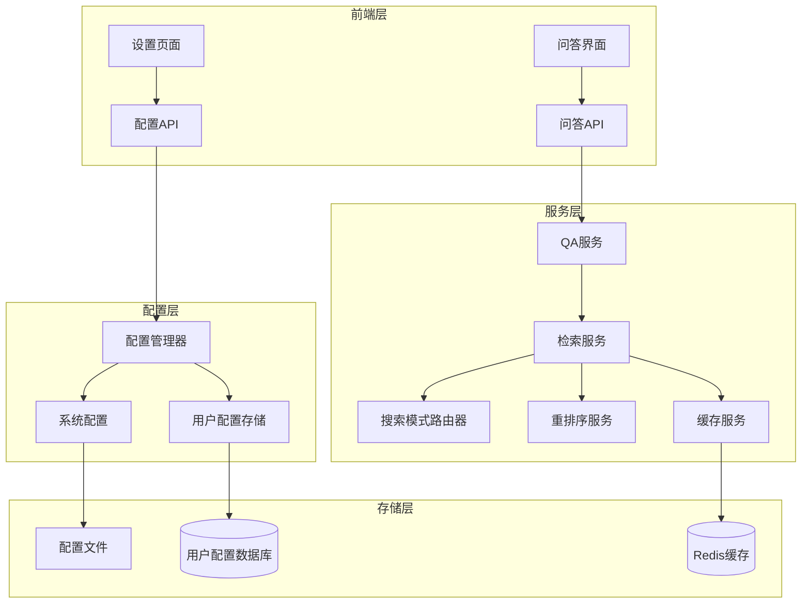
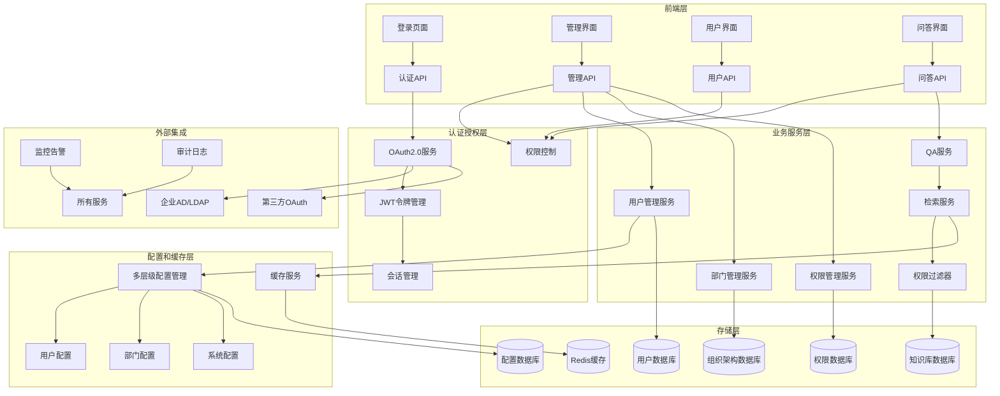
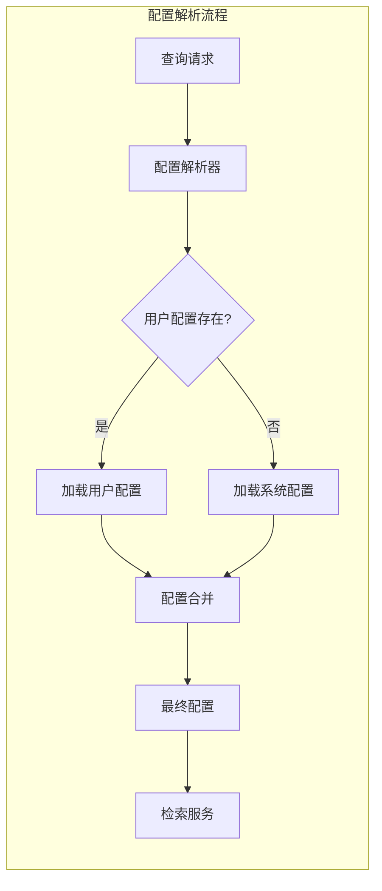

# 检索功能三个配置参数实现设计文档

## 概述

本设计文档描述了如何实现检索系统中三个关键配置参数的技术方案：搜索模式选择、重排序功能和检索缓存。设计采用分层配置架构，支持系统级默认配置和用户级个性化配置，并分两个阶段实现。

## 架构设计

### 整体架构

#### 第一阶段架构（基础功能）



#### 第二阶段架构（企业级功能）



### 配置层级架构



## 组件和接口设计

### 第一阶段组件（基础功能）

#### 1. 配置管理组件

#### ConfigurationManager 类
```python
class ConfigurationManager:
    """配置管理器 - 处理分层配置逻辑"""
    
    def __init__(self):
        self.system_config: RetrievalConfig = None
        self.user_config_store: UserConfigStore = None
    
    async def get_retrieval_config(self, user_id: Optional[str] = None) -> RetrievalConfig:
        """获取最终的检索配置（合并用户和系统配置）"""
        pass
    
    async def update_system_config(self, config: RetrievalConfig) -> None:
        """更新系统级配置"""
        pass
    
    async def update_user_config(self, user_id: str, config: RetrievalConfig) -> None:
        """更新用户级配置（第二阶段）"""
        pass
```

#### UserConfigStore 类（第二阶段）
```python
class UserConfigStore:
    """用户配置存储"""
    
    async def get_user_config(self, user_id: str) -> Optional[RetrievalConfig]:
        """获取用户个性化配置"""
        pass
    
    async def save_user_config(self, user_id: str, config: RetrievalConfig) -> None:
        """保存用户个性化配置"""
        pass
    
    async def delete_user_config(self, user_id: str) -> None:
        """删除用户个性化配置"""
        pass
```

### 2. 搜索模式路由组件

#### SearchModeRouter 类
```python
class SearchModeRouter:
    """搜索模式路由器 - 根据配置选择搜索方法"""
    
    def __init__(self, retrieval_service: RetrievalService):
        self.retrieval_service = retrieval_service
    
    async def search_with_mode(
        self, 
        query: str, 
        config: RetrievalConfig,
        **kwargs
    ) -> List[SearchResult]:
        """根据搜索模式执行相应的搜索方法"""
        if config.search_mode == 'semantic':
            return await self._semantic_search(query, config, **kwargs)
        elif config.search_mode == 'keyword':
            return await self._keyword_search(query, config, **kwargs)
        elif config.search_mode == 'hybrid':
            return await self._hybrid_search(query, config, **kwargs)
        else:
            # 降级到默认语义搜索
            return await self._semantic_search(query, config, **kwargs)
    
    async def _semantic_search(self, query: str, config: RetrievalConfig, **kwargs) -> List[SearchResult]:
        """语义搜索实现"""
        pass
    
    async def _keyword_search(self, query: str, config: RetrievalConfig, **kwargs) -> List[SearchResult]:
        """关键词搜索实现"""
        pass
    
    async def _hybrid_search(self, query: str, config: RetrievalConfig, **kwargs) -> List[SearchResult]:
        """混合搜索实现"""
        pass
```

### 3. 重排序服务组件

#### RerankingService 类
```python
class RerankingService:
    """重排序服务"""
    
    def __init__(self):
        self.reranker_model = None
        self.model_loaded = False
    
    async def initialize(self) -> None:
        """初始化重排序模型"""
        try:
            from sentence_transformers import CrossEncoder
            self.reranker_model = CrossEncoder('cross-encoder/ms-marco-MiniLM-L-6-v2')
            self.model_loaded = True
        except Exception as e:
            logger.warning(f"重排序模型加载失败: {e}")
            self.model_loaded = False
    
    async def rerank_results(
        self, 
        query: str, 
        results: List[SearchResult], 
        config: RetrievalConfig
    ) -> List[SearchResult]:
        """对检索结果进行重排序"""
        if not config.enable_rerank or not self.model_loaded or not results:
            return results
        
        try:
            # 准备查询-文档对
            pairs = [(query, result.content) for result in results]
            
            # 计算重排序分数
            scores = self.reranker_model.predict(pairs)
            
            # 更新结果分数并重新排序
            for i, score in enumerate(scores):
                results[i].similarity_score = float(score)
            
            return sorted(results, key=lambda x: x.similarity_score, reverse=True)
            
        except Exception as e:
            logger.error(f"重排序失败: {e}")
            # 降级返回原始结果
            return results
```

### 4. 缓存服务组件

#### CacheService 类
```python
class CacheService:
    """检索缓存服务"""
    
    def __init__(self, config: Dict[str, Any]):
        self.redis_client = None
        self.cache_enabled = False
        self.cache_ttl = config.get('cache_ttl', 3600)  # 默认1小时
    
    async def initialize(self) -> None:
        """初始化缓存服务"""
        try:
            import redis.asyncio as redis
            self.redis_client = redis.Redis(
                host=config.get('redis_host', 'localhost'),
                port=config.get('redis_port', 6379),
                db=config.get('redis_db', 0),
                decode_responses=True
            )
            await self.redis_client.ping()
            self.cache_enabled = True
        except Exception as e:
            logger.warning(f"缓存服务初始化失败: {e}")
            self.cache_enabled = False
    
    async def get_cached_results(
        self, 
        cache_key: str, 
        config: RetrievalConfig
    ) -> Optional[List[SearchResult]]:
        """获取缓存的检索结果"""
        if not config.enable_cache or not self.cache_enabled:
            return None
        
        try:
            cached_data = await self.redis_client.get(cache_key)
            if cached_data:
                # 反序列化缓存数据
                return self._deserialize_results(cached_data)
        except Exception as e:
            logger.error(f"缓存读取失败: {e}")
        
        return None
    
    async def cache_results(
        self, 
        cache_key: str, 
        results: List[SearchResult], 
        config: RetrievalConfig
    ) -> None:
        """缓存检索结果"""
        if not config.enable_cache or not self.cache_enabled:
            return
        
        try:
            # 序列化结果数据
            serialized_data = self._serialize_results(results)
            await self.redis_client.setex(cache_key, self.cache_ttl, serialized_data)
        except Exception as e:
            logger.error(f"缓存写入失败: {e}")
    
    def _generate_cache_key(self, query: str, config: RetrievalConfig) -> str:
        """生成缓存键"""
        import hashlib
        
        # 包含影响检索结果的关键配置参数
        key_components = [
            query,
            config.search_mode,
            str(config.top_k),
            str(config.similarity_threshold),
            str(config.enable_rerank)
        ]
        
        key_string = "|".join(key_components)
        return f"retrieval:{hashlib.md5(key_string.encode()).hexdigest()}"
    
    def _serialize_results(self, results: List[SearchResult]) -> str:
        """序列化检索结果"""
        import json
        return json.dumps([result.to_dict() for result in results])
    
    def _deserialize_results(self, data: str) -> List[SearchResult]:
        """反序列化检索结果"""
        import json
        result_dicts = json.loads(data)
        return [SearchResult.from_dict(result_dict) for result_dict in result_dicts]
```

### 5. 增强的检索服务

#### EnhancedRetrievalService 类
```python
class EnhancedRetrievalService(RetrievalService):
    """增强的检索服务 - 集成所有新功能"""
    
    def __init__(self, config: Optional[Dict[str, Any]] = None):
        super().__init__(config)
        
        # 初始化新组件
        self.config_manager = ConfigurationManager()
        self.search_router = SearchModeRouter(self)
        self.reranking_service = RerankingService()
        self.cache_service = CacheService(config or {})
    
    async def initialize(self) -> None:
        """初始化增强检索服务"""
        await super().initialize()
        
        # 初始化新组件
        await self.config_manager.initialize()
        await self.reranking_service.initialize()
        await self.cache_service.initialize()
    
    async def search_with_config(
        self, 
        query: str, 
        user_id: Optional[str] = None,
        **kwargs
    ) -> List[SearchResult]:
        """使用配置进行检索的主要方法"""
        
        # 1. 获取最终配置
        config = await self.config_manager.get_retrieval_config(user_id)
        
        # 2. 生成缓存键
        cache_key = self.cache_service._generate_cache_key(query, config)
        
        # 3. 尝试从缓存获取结果
        cached_results = await self.cache_service.get_cached_results(cache_key, config)
        if cached_results:
            logger.info(f"缓存命中: {cache_key}")
            return cached_results
        
        # 4. 执行检索
        results = await self.search_router.search_with_mode(query, config, **kwargs)
        
        # 5. 重排序（如果启用）
        results = await self.reranking_service.rerank_results(query, results, config)
        
        # 6. 缓存结果
        await self.cache_service.cache_results(cache_key, results, config)
        
        return results
```

## 数据模型

### 扩展的配置模型

```python
@dataclass
class RetrievalConfig:
    """检索配置（扩展版本）"""
    top_k: int = 5
    similarity_threshold: float = 0.7
    search_mode: str = "semantic"
    enable_rerank: bool = False
    enable_cache: bool = False
    
    # 新增字段
    user_id: Optional[str] = None  # 用户ID（第二阶段）
    is_user_config: bool = False   # 是否为用户配置
    created_at: Optional[datetime] = None
    updated_at: Optional[datetime] = None
    
    def merge_with_system_config(self, system_config: 'RetrievalConfig') -> 'RetrievalConfig':
        """与系统配置合并"""
        # 用户配置优先，未设置的字段使用系统配置
        merged = RetrievalConfig()
        
        for field in ['top_k', 'similarity_threshold', 'search_mode', 'enable_rerank', 'enable_cache']:
            user_value = getattr(self, field)
            system_value = getattr(system_config, field)
            
            # 如果用户配置为None或使用默认值，则使用系统配置
            if user_value is None or (self.is_user_config and user_value == getattr(RetrievalConfig(), field)):
                setattr(merged, field, system_value)
            else:
                setattr(merged, field, user_value)
        
        return merged
```

### 用户配置数据模型（第二阶段）

```python
@dataclass
class UserRetrievalConfig:
    """用户检索配置"""
    user_id: str
    search_mode: Optional[str] = None  # None表示使用系统默认
    enable_rerank: Optional[bool] = None
    enable_cache: Optional[bool] = None  # 缓存通常是系统级设置
    top_k: Optional[int] = None
    similarity_threshold: Optional[float] = None
    created_at: datetime = field(default_factory=datetime.now)
    updated_at: datetime = field(default_factory=datetime.now)
    
    def to_retrieval_config(self) -> RetrievalConfig:
        """转换为标准检索配置"""
        return RetrievalConfig(
            top_k=self.top_k or 5,
            similarity_threshold=self.similarity_threshold or 0.7,
            search_mode=self.search_mode or "semantic",
            enable_rerank=self.enable_rerank or False,
            enable_cache=self.enable_cache or False,
            user_id=self.user_id,
            is_user_config=True
        )
```

## 错误处理策略

### 降级机制

1. **搜索模式降级**：
   - 混合搜索失败 → 语义搜索
   - 关键词搜索失败 → 语义搜索
   - 语义搜索失败 → 返回错误

2. **重排序降级**：
   - 重排序模型加载失败 → 跳过重排序
   - 重排序计算失败 → 返回原始结果

3. **缓存降级**：
   - Redis连接失败 → 直接执行检索
   - 缓存读写失败 → 记录日志但不影响检索

4. **配置降级**：
   - 用户配置无效 → 使用系统配置
   - 系统配置无效 → 使用硬编码默认值

### 错误监控

```python
class RetrievalMetrics:
    """检索指标收集"""
    
    def __init__(self):
        self.search_mode_usage = Counter()
        self.cache_hit_rate = 0.0
        self.rerank_success_rate = 0.0
        self.error_counts = Counter()
    
    def record_search_mode(self, mode: str):
        """记录搜索模式使用"""
        self.search_mode_usage[mode] += 1
    
    def record_cache_hit(self, hit: bool):
        """记录缓存命中"""
        # 更新缓存命中率
        pass
    
    def record_error(self, component: str, error_type: str):
        """记录错误"""
        self.error_counts[f"{component}:{error_type}"] += 1
```

## 测试策略

### 单元测试

1. **配置管理测试**：
   - 系统配置加载和保存
   - 用户配置合并逻辑
   - 配置验证和降级

2. **搜索模式测试**：
   - 各种搜索模式的正确路由
   - 搜索模式失败时的降级

3. **重排序测试**：
   - 重排序功能的正确性
   - 重排序失败时的降级

4. **缓存测试**：
   - 缓存存取功能
   - 缓存失效和清理

### 集成测试

1. **端到端流程测试**：
   - 从前端配置到后端检索的完整流程
   - 不同配置组合的测试

2. **性能测试**：
   - 缓存命中率和性能提升
   - 重排序对响应时间的影响

3. **错误恢复测试**：
   - 各种故障场景下的系统行为
   - 降级机制的有效性

## 实施计划

### 第一阶段：系统级配置（优先级1-3）

#### 阶段1.1：搜索模式选择（1-2天）
- [ ] 实现 SearchModeRouter 类
- [ ] 修改 QA 服务集成搜索模式路由
- [ ] 添加配置传递逻辑
- [ ] 单元测试和集成测试

#### 阶段1.2：检索缓存（3-5天）
- [ ] 实现 CacheService 类
- [ ] 集成缓存到检索流程
- [ ] 添加缓存管理功能
- [ ] 性能测试和优化

#### 阶段1.3：重排序功能（5-7天）
- [ ] 实现 RerankingService 类
- [ ] 集成重排序到检索流程
- [ ] 添加模型管理和错误处理
- [ ] 准确性测试和性能优化

#### 阶段1.4：集成和测试（2-3天）
- [ ] 实现 EnhancedRetrievalService
- [ ] 端到端集成测试
- [ ] 性能基准测试
- [ ] 文档和部署

### 第二阶段：企业级用户管理和权限系统（后续实现）

#### 阶段2.1：用户和部门管理系统
- [ ] 设计用户管理数据库表（用户、部门、角色关系）
- [ ] 实现用户管理API（用户CRUD、密码管理、状态管理）
- [ ] 实现部门管理API（层级结构、部门成员管理）
- [ ] 添加用户和部门管理界面（用户列表、部门树形结构）
- [ ] 实现用户导入导出功能（支持批量操作）

#### 阶段2.2：OAuth2.0认证授权系统
- [ ] 设计OAuth2.0认证流程（Authorization Code、Client Credentials等）
- [ ] 实现JWT令牌管理（Access Token、Refresh Token生成和验证）
- [ ] 集成第三方认证提供商（企业AD、LDAP、Google、GitHub、微信企业版等）
- [ ] 实现统一登录界面（支持多种登录方式）
- [ ] 添加会话管理和令牌刷新机制
- [ ] 实现单点登录（SSO）支持

#### 阶段2.3：基于角色的权限控制系统（RBAC）
- [ ] 设计权限模型（资源、操作、角色、权限矩阵）
- [ ] 实现权限管理API（角色管理、权限分配、权限检查）
- [ ] 添加权限装饰器和中间件（API级别的权限控制）
- [ ] 实现权限管理界面（角色配置、权限分配可视化）
- [ ] 添加审计日志（用户操作记录、权限变更记录）

#### 阶段2.4：知识库权限和多租户支持
- [ ] 设计知识库权限模型（部门级、用户级、文档级访问控制）
- [ ] 实现知识库权限检查逻辑（读取、编辑、删除、分享权限）
- [ ] 修改文档检索服务支持权限过滤（基于用户身份过滤可见文档）
- [ ] 添加知识库权限管理界面（权限矩阵、批量授权）
- [ ] 实现多租户数据隔离（租户级数据分离、资源配额管理）
- [ ] 添加知识库分享和协作功能

#### 阶段2.5：个性化配置和偏好系统
- [ ] 实现多层级配置存储（用户级 > 部门级 > 系统级）
- [ ] 实现配置继承和合并逻辑（智能配置继承）
- [ ] 修改 ConfigurationManager 支持权限感知的配置管理
- [ ] 添加个性化配置界面（用户偏好设置、主题定制）
- [ ] 实现配置模板和预设（常用配置的快速应用）

#### 阶段2.6：企业级功能增强
- [ ] 实现组织架构管理（支持复杂的企业组织结构）
- [ ] 添加工作流审批（文档发布审批、权限申请审批）
- [ ] 实现数据统计和报表（用户活跃度、知识库使用情况）
- [ ] 添加系统监控和告警（性能监控、异常告警）
- [ ] 实现数据备份和恢复（定期备份、灾难恢复）

## 性能考虑

### 缓存策略
- **缓存键设计**：包含所有影响结果的参数
- **缓存过期**：默认1小时，可配置
- **缓存大小**：使用Redis的内存管理
- **缓存预热**：常见查询的预缓存

### 重排序优化
- **批处理**：批量处理多个查询-文档对
- **模型缓存**：重排序模型的内存缓存
- **异步处理**：重排序的异步执行
- **结果限制**：只对top-N结果重排序

### 配置缓存
- **内存缓存**：系统配置的内存缓存
- **配置变更通知**：配置更新时的实时通知
- **配置预加载**：启动时预加载常用配置

### 第二阶段组件（企业级功能）

#### 1. 用户管理组件

##### UserManagementService 类
```python
class UserManagementService:
    """用户管理服务"""
    
    def __init__(self, db_session):
        self.db = db_session
        self.password_hasher = PasswordHasher()
    
    async def create_user(self, user_data: CreateUserRequest) -> User:
        """创建新用户"""
        pass
    
    async def update_user(self, user_id: str, user_data: UpdateUserRequest) -> User:
        """更新用户信息"""
        pass
    
    async def delete_user(self, user_id: str) -> bool:
        """删除用户（软删除）"""
        pass
    
    async def get_user_by_id(self, user_id: str) -> Optional[User]:
        """根据ID获取用户"""
        pass
    
    async def get_users_by_department(self, dept_id: str) -> List[User]:
        """获取部门用户列表"""
        pass
    
    async def import_users_from_csv(self, csv_data: str) -> ImportResult:
        """批量导入用户"""
        pass
```

##### DepartmentManagementService 类
```python
class DepartmentManagementService:
    """部门管理服务"""
    
    def __init__(self, db_session):
        self.db = db_session
    
    async def create_department(self, dept_data: CreateDepartmentRequest) -> Department:
        """创建部门"""
        pass
    
    async def update_department(self, dept_id: str, dept_data: UpdateDepartmentRequest) -> Department:
        """更新部门信息"""
        pass
    
    async def get_department_tree(self, root_dept_id: Optional[str] = None) -> DepartmentTree:
        """获取部门树形结构"""
        pass
    
    async def move_department(self, dept_id: str, new_parent_id: str) -> bool:
        """移动部门到新的父部门"""
        pass
    
    async def get_department_members(self, dept_id: str, include_subdepts: bool = False) -> List[User]:
        """获取部门成员"""
        pass
```

#### 2. 认证授权组件

##### OAuth2Service 类
```python
class OAuth2Service:
    """OAuth2.0认证服务"""
    
    def __init__(self, config: OAuth2Config):
        self.config = config
        self.jwt_manager = JWTManager(config.jwt_secret)
        self.providers = self._init_providers()
    
    async def authenticate_with_password(self, username: str, password: str) -> AuthResult:
        """用户名密码认证"""
        pass
    
    async def authenticate_with_oauth(self, provider: str, auth_code: str) -> AuthResult:
        """OAuth第三方认证"""
        pass
    
    async def authenticate_with_ldap(self, username: str, password: str) -> AuthResult:
        """LDAP认证"""
        pass
    
    async def refresh_token(self, refresh_token: str) -> TokenPair:
        """刷新访问令牌"""
        pass
    
    async def revoke_token(self, token: str) -> bool:
        """撤销令牌"""
        pass
    
    def _init_providers(self) -> Dict[str, OAuthProvider]:
        """初始化OAuth提供商"""
        providers = {}
        if self.config.google_enabled:
            providers['google'] = GoogleOAuthProvider(self.config.google_config)
        if self.config.github_enabled:
            providers['github'] = GitHubOAuthProvider(self.config.github_config)
        if self.config.wechat_enabled:
            providers['wechat'] = WeChatOAuthProvider(self.config.wechat_config)
        return providers
```

##### RBACService 类
```python
class RBACService:
    """基于角色的访问控制服务"""
    
    def __init__(self, db_session):
        self.db = db_session
        self.permission_cache = PermissionCache()
    
    async def create_role(self, role_data: CreateRoleRequest) -> Role:
        """创建角色"""
        pass
    
    async def assign_role_to_user(self, user_id: str, role_id: str) -> bool:
        """为用户分配角色"""
        pass
    
    async def grant_permission_to_role(self, role_id: str, permission: Permission) -> bool:
        """为角色授予权限"""
        pass
    
    async def check_permission(self, user_id: str, resource: str, action: str) -> bool:
        """检查用户权限"""
        # 先检查缓存
        cached_result = await self.permission_cache.get_permission(user_id, resource, action)
        if cached_result is not None:
            return cached_result
        
        # 从数据库查询
        user_permissions = await self._get_user_permissions(user_id)
        has_permission = self._evaluate_permission(user_permissions, resource, action)
        
        # 缓存结果
        await self.permission_cache.set_permission(user_id, resource, action, has_permission)
        return has_permission
    
    async def get_user_permissions(self, user_id: str) -> List[Permission]:
        """获取用户所有权限"""
        pass
    
    async def audit_permission_change(self, change: PermissionChange) -> None:
        """记录权限变更审计日志"""
        pass
```

#### 3. 知识库权限组件

##### KnowledgeBasePermissionService 类
```python
class KnowledgeBasePermissionService:
    """知识库权限服务"""
    
    def __init__(self, db_session, rbac_service: RBACService):
        self.db = db_session
        self.rbac = rbac_service
    
    async def set_document_permission(self, doc_id: str, permission: DocumentPermission) -> bool:
        """设置文档权限"""
        pass
    
    async def check_document_access(self, user_id: str, doc_id: str, action: str) -> bool:
        """检查文档访问权限"""
        # 检查文档级权限
        doc_permission = await self._get_document_permission(doc_id)
        if doc_permission:
            return await self._check_document_permission(user_id, doc_permission, action)
        
        # 检查知识库级权限
        kb_id = await self._get_document_knowledge_base(doc_id)
        return await self.rbac.check_permission(user_id, f"knowledge_base:{kb_id}", action)
    
    async def filter_accessible_documents(self, user_id: str, doc_ids: List[str]) -> FilterResult:
        """过滤用户可访问的文档，返回可访问文档和权限信息"""
        accessible_docs = []
        restricted_count = 0
        
        for doc_id in doc_ids:
            if await self.check_document_access(user_id, doc_id, "read"):
                accessible_docs.append(doc_id)
            else:
                restricted_count += 1
        
        return FilterResult(
            accessible_documents=accessible_docs,
            restricted_count=restricted_count,
            total_count=len(doc_ids)
        )
    
    async def share_document(self, doc_id: str, from_user_id: str, to_user_id: str, permission_level: str) -> bool:
        """分享文档给其他用户"""
        pass
    
    async def get_user_accessible_knowledge_bases(self, user_id: str) -> List[str]:
        """获取用户可访问的知识库列表"""
        pass
    
    async def generate_permission_hint(self, user_id: str, restricted_count: int, query: str) -> PermissionHint:
        """生成权限提示信息"""
        user = await self._get_user(user_id)
        user_dept = await self._get_user_department(user_id)
        
        hint = PermissionHint()
        
        if restricted_count > 0:
            hint.has_restrictions = True
            hint.restricted_count = restricted_count
            hint.message = f"由于权限限制，有 {restricted_count} 个相关文档无法显示。"
            
            # 提供权限申请建议
            if user_dept:
                dept_admin = await self._get_department_admin(user_dept.id)
                if dept_admin:
                    hint.contact_info = f"如需访问更多内容，请联系部门管理员：{dept_admin.full_name}"
            
            # 提供权限申请入口
            hint.permission_request_url = f"/permission/request?query={query}&user_id={user_id}"
            
            # 建议可访问的知识库
            accessible_kbs = await self.get_user_accessible_knowledge_bases(user_id)
            if accessible_kbs:
                hint.suggestions = f"您可以在以下知识库中搜索：{', '.join(accessible_kbs)}"
        
        return hint
```

#### 4. 多层级配置组件

##### MultiLevelConfigManager 类
```python
class MultiLevelConfigManager:
    """多层级配置管理器"""
    
    def __init__(self, db_session):
        self.db = db_session
        self.config_cache = ConfigCache()
    
    async def get_effective_config(self, user_id: str) -> RetrievalConfig:
        """获取用户的有效配置（合并所有层级）"""
        # 获取用户配置
        user_config = await self._get_user_config(user_id)
        
        # 获取部门配置
        user_dept = await self._get_user_department(user_id)
        dept_config = await self._get_department_config(user_dept.id) if user_dept else None
        
        # 获取系统配置
        system_config = await self._get_system_config()
        
        # 合并配置（用户 > 部门 > 系统）
        return self._merge_configs(user_config, dept_config, system_config)
    
    async def set_user_config(self, user_id: str, config: RetrievalConfig) -> bool:
        """设置用户级配置"""
        pass
    
    async def set_department_config(self, dept_id: str, config: RetrievalConfig) -> bool:
        """设置部门级配置"""
        pass
    
    async def get_config_inheritance_chain(self, user_id: str) -> ConfigInheritanceChain:
        """获取配置继承链"""
        pass
    
    def _merge_configs(self, user_config: Optional[RetrievalConfig], 
                      dept_config: Optional[RetrievalConfig], 
                      system_config: RetrievalConfig) -> RetrievalConfig:
        """合并多层级配置"""
        merged = RetrievalConfig()
        
        # 按优先级合并每个字段
        for field in ['search_mode', 'enable_rerank', 'enable_cache', 'top_k', 'similarity_threshold']:
            value = None
            
            # 用户配置优先级最高
            if user_config and getattr(user_config, field) is not None:
                value = getattr(user_config, field)
            # 其次是部门配置
            elif dept_config and getattr(dept_config, field) is not None:
                value = getattr(dept_config, field)
            # 最后是系统配置
            else:
                value = getattr(system_config, field)
            
            setattr(merged, field, value)
        
        return merged
```

#### 5. 企业级功能组件

##### WorkflowService 类
```python
class WorkflowService:
    """工作流服务"""
    
    def __init__(self, db_session):
        self.db = db_session
        self.notification_service = NotificationService()
    
    async def create_approval_workflow(self, workflow_data: CreateWorkflowRequest) -> Workflow:
        """创建审批工作流"""
        pass
    
    async def submit_approval_request(self, request_data: ApprovalRequest) -> ApprovalInstance:
        """提交审批请求"""
        pass
    
    async def process_approval(self, instance_id: str, action: str, comment: str, approver_id: str) -> bool:
        """处理审批"""
        pass
    
    async def get_pending_approvals(self, user_id: str) -> List[ApprovalInstance]:
        """获取待审批列表"""
        pass
```

##### AuditService 类
```python
class AuditService:
    """审计服务"""
    
    def __init__(self, db_session):
        self.db = db_session
        self.log_queue = AuditLogQueue()
    
    async def log_user_action(self, user_id: str, action: str, resource: str, details: Dict[str, Any]) -> None:
        """记录用户操作"""
        audit_log = AuditLog(
            user_id=user_id,
            action=action,
            resource=resource,
            details=details,
            timestamp=datetime.now(),
            ip_address=self._get_client_ip(),
            user_agent=self._get_user_agent()
        )
        await self.log_queue.enqueue(audit_log)
    
    async def log_permission_change(self, change: PermissionChange) -> None:
        """记录权限变更"""
        pass
    
    async def get_audit_logs(self, filters: AuditLogFilters) -> List[AuditLog]:
        """查询审计日志"""
        pass
    
    async def generate_audit_report(self, report_config: AuditReportConfig) -> AuditReport:
        """生成审计报告"""
        pass
```

##### MonitoringService 类
```python
class MonitoringService:
    """监控服务"""
    
    def __init__(self):
        self.metrics_collector = MetricsCollector()
        self.alert_manager = AlertManager()
    
    async def collect_system_metrics(self) -> SystemMetrics:
        """收集系统指标"""
        pass
    
    async def collect_business_metrics(self) -> BusinessMetrics:
        """收集业务指标"""
        pass
    
    async def check_health(self) -> HealthStatus:
        """健康检查"""
        pass
    
    async def trigger_alert(self, alert: Alert) -> None:
        """触发告警"""
        pass
    
    async def get_performance_dashboard(self) -> Dashboard:
        """获取性能仪表板数据"""
        pass
```

## 数据模型扩展

### 企业级数据模型

```python
@dataclass
class User:
    """用户模型"""
    id: str
    username: str
    email: str
    full_name: str
    department_id: Optional[str]
    roles: List[str]
    status: UserStatus  # ACTIVE, INACTIVE, SUSPENDED
    created_at: datetime
    updated_at: datetime
    last_login: Optional[datetime]
    
@dataclass
class Department:
    """部门模型"""
    id: str
    name: str
    parent_id: Optional[str]
    description: Optional[str]
    manager_id: Optional[str]
    created_at: datetime
    updated_at: datetime
    
@dataclass
class Role:
    """角色模型"""
    id: str
    name: str
    description: str
    permissions: List[Permission]
    created_at: datetime
    updated_at: datetime
    
@dataclass
class Permission:
    """权限模型"""
    id: str
    resource: str  # 资源类型，如 "knowledge_base", "document", "system"
    action: str    # 操作类型，如 "read", "write", "delete", "admin"
    conditions: Optional[Dict[str, Any]]  # 权限条件
    
@dataclass
class DocumentPermission:
    """文档权限模型"""
    document_id: str
    permission_type: str  # PUBLIC, DEPARTMENT, PRIVATE, CUSTOM
    allowed_users: List[str]
    allowed_departments: List[str]
    allowed_roles: List[str]
    created_by: str
    created_at: datetime

@dataclass
class FilterResult:
    """文档过滤结果"""
    accessible_documents: List[str]
    restricted_count: int
    total_count: int
    
@dataclass
class PermissionHint:
    """权限提示信息"""
    has_restrictions: bool = False
    restricted_count: int = 0
    message: str = ""
    contact_info: str = ""
    permission_request_url: str = ""
    suggestions: str = ""
```

这个设计提供了一个完整、可扩展的企业级解决方案，支持分阶段实施，涵盖了用户管理、认证授权、权限控制、知识库权限、多层级配置、工作流、审计监控等企业级功能，并考虑了性能、安全性和可维护性。